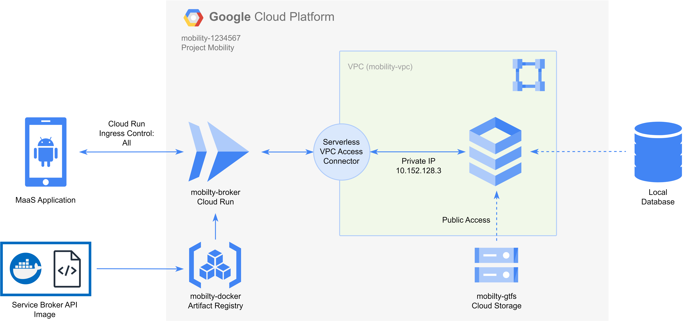

# Service Broker Prototype for Mobility-as-a-Service App (Bandung Area)
The MaaS app allows for seamless travel across different (transportation) operator services. The service broker, a component of the MaaS app, integrates the services of various operators into a single platform, thereby facilitating seamless journeys for users.

Tech stack: Express.js, PostgreSQL, GCP

## Architecture

## Base URL
https://mobility-broker-g53hhdjn2a-as.a.run.app (deprecated)

## Note
This prototype doesn't fully implement the service broker concept. It only utilizes some journey plan data that was generated by Open Trip Planner (OTP) manually for some use cases (Terminal Elang and Terminal Cicaheum). It doesn't interact directly with the journey planner. It should integrate with a journey planner such as OTP for best practice.